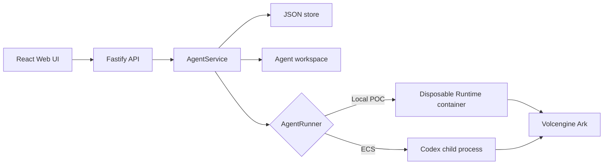
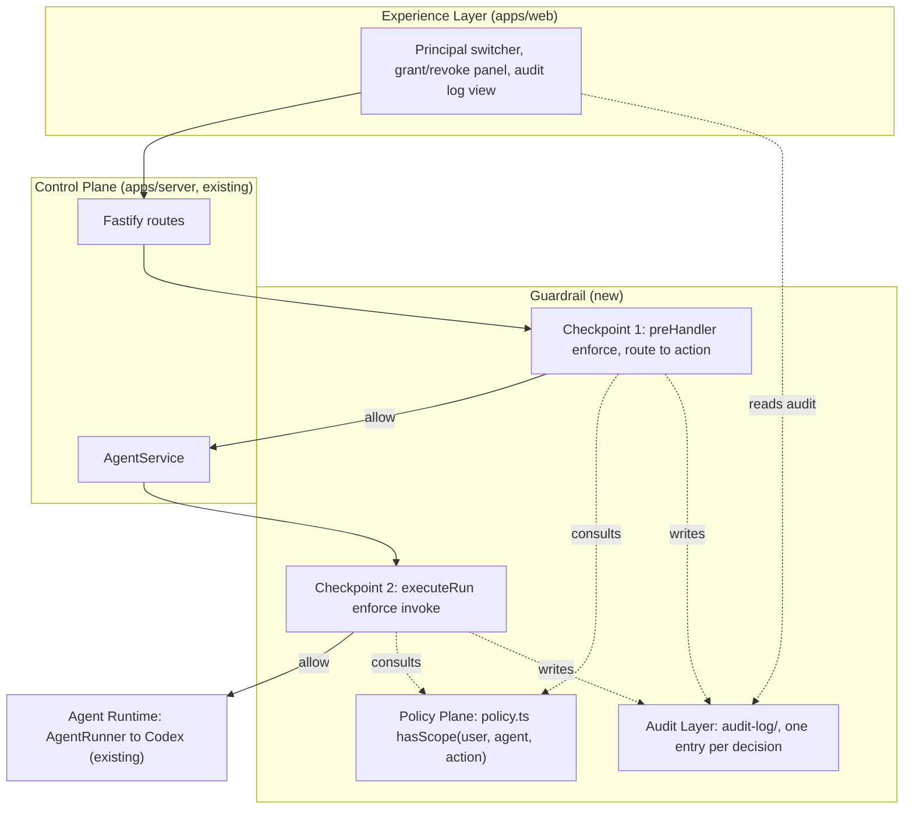

# Architecture

Volc Agent Launchpad is a single-node control plane for hackathon use.



## Components

### Web UI

Lists Agents, manages lifecycle actions, submits prompts, and polls asynchronous
Runs. It never receives the Ark API key.

### Fastify API

Validates requests, protects remote demos with a shared bearer token, and
serves the compiled Web UI. The token is not user identity or authorization.

### AgentService

Coordinates lifecycle state, persistence, workspaces, and Runs. One Agent can
have only one active Run.

```text
ready -> busy -> ready
  |       |
  v       v
stopped  error
```

Interrupted Runs become `cancelled` after a restart.

### Storage

```text
data/launchpad.json       Agent, message, and Run metadata
workspaces/AgentID/       Agent-created files
workspaces/.deleted/      Archived deleted workspaces
codex-home/               Codex configuration and sessions
```

`JsonStore` serializes writes and atomically replaces one JSON file. It supports
one process only.

### Runtime providers

- `CodexRunner` runs Codex inside the application container for ECS.
- `ContainerCodexRunner` starts one disposable Docker, Colima, or Podman
  container for every local turn.

Both providers use argv-only process execution, bound output and time, resume
the stored Codex thread, and escalate termination after a grace period.

## Deployment profiles

| Profile | Control plane | Agent execution |
| --- | --- | --- |
| Local POC | Host Node.js | Disposable local container |
| ECS | Application container | Codex process in the same container |
| Local development | Host Node.js | Host Codex process |

## Extension seams

| Track | Primary seam | Expected change |
| --- | --- | --- |
| Glass Box | `AgentRunner`, `AgentRun` | Emit and display correlated execution events. |
| Bouncer | API routes, Agent ownership | Add identity and server-side authorization. |
| Kill Switch | `AgentRunner` | Add threat-specific policy or a stronger sandbox. |

The current container or ECS instance is the POC trust boundary. Ordinary
containers are not hardened multi-tenant isolation.

## Guardrail (Bouncer track)

This fork implements the Bouncer track: per-Agent delegated, revocable, scoped
access control, enforced server-side with an audit trail of every decision.
Full contract, data model, and route→action map:
[POLICY_ENFORCEMENT.md](POLICY_ENFORCEMENT.md).



| Layer | Lives in | Owns |
| --- | --- | --- |
| Identity | `apps/server/src/app.ts` onRequest hook, `seed.ts` | `X-User-Id` → seeded principal; unknown/missing → 401 |
| Policy | `apps/server/src/policy.ts` | `hasScope(user, agentId, action)`; owner-only `delete`/`grant`/`revoke`; live-grant lookup |
| Enforcement | `apps/server/src/enforcement.ts` | route→action `RULES`, `enforce()` at both checkpoints |
| Audit | `apps/server/src/audit-log/` | append + query store, redaction, `GET /api/audit` |
| Experience | `apps/web/src/App.tsx` | principal switcher, grant/revoke UI, audit view, allow/deny feedback |

Key property: checkpoint 2 re-runs the check at the `AgentRunner` boundary, so a
request that bypasses the HTTP layer (a direct `AgentService` call) still cannot
reach Codex. Revocation is a pure read over the store snapshot, so it takes
effect on the caller's next request.
