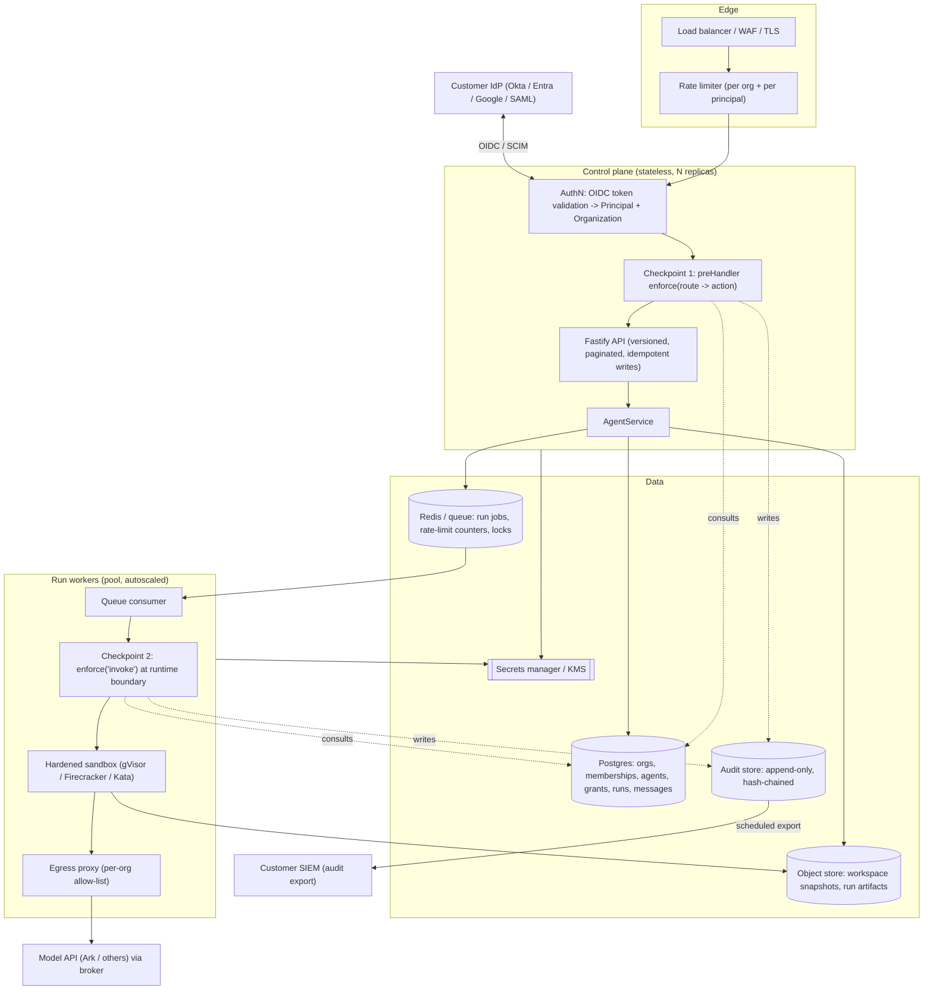

# ADR 0001 — Enterprise multi-tenant SaaS target architecture

- **Status:** Proposed
- **Date:** 2026-09-10
- **Deciders:** Platform team
- **Supersedes:** none

## Context

The current system (`docs/ARCHITECTURE.md`, `docs/POLICY_ENFORCEMENT.md`) is a
hackathon proof of concept for the **Bouncer** track: per-Agent delegated,
scoped, revocable authorization, enforced at two checkpoints, with an audit
trail. The authorization model and the double-checkpoint enforcement are sound
and worth keeping. Everything around them is POC-grade:

| Area | Today | Enterprise SaaS needs |
| --- | --- | --- |
| Identity | `X-User-Id` header + 3 seeded users; anything that can set a header is any principal | Real SSO per customer org, verified tokens, session lifecycle, SCIM provisioning |
| Tenancy | none — one flat namespace | Organization as a first-class isolation boundary on every row and every request |
| Persistence | single-process JSON file (`JsonStore`) | Transactional DB, migrations, concurrency, backups, PITR, horizontal scale |
| AuthZ grantees | individual users only | users **and** groups/teams; role templates; approval workflow for sensitive grants |
| Audit store | mutable `audit.jsonl` | append-only / tamper-evident, retention policy, export to customer SIEM |
| Runtime isolation | ordinary container, `--cap-drop ALL` + `no-new-privileges`, broad egress | hardened per-tenant sandbox, egress allow-list, secrets broker, no shared model key |
| Run execution | in-process, lost on restart (`cancelled` after reboot) | durable queue, at-least-once with idempotency, multi-worker, recovery |
| Observability | pino logs only | OpenTelemetry traces across both checkpoints, metrics, deny/anomaly alerting |
| API | unversioned, no rate limits, no idempotency keys | versioned, paginated, rate-limited, idempotent writes, published OpenAPI |
| SDLC | typecheck + tests + build in CI | SAST, dependency + container + IaC scanning, secrets scanning, threat model, load tests |
| Secrets | Ark key in server env, mounted into every Runtime container; also in Terraform state | central secrets manager, per-tenant credentials, no long-lived key in agent scope |

This ADR defines the **target architecture** and the **sequence** to get there.
It does not implement anything. Individual pieces get their own follow-up ADRs
as they are designed in detail.

## Decision

Build toward a **multi-tenant SaaS** with a stateless control plane, a
Postgres system of record, a durable run queue with pooled sandboxed workers,
and enterprise identity delegated to a dedicated provider. Preserve the two
enforcement checkpoints and the single `hasScope` primitive as the
authorization core; extend them with tenancy and group-based grants rather than
replacing them.

### Guiding principles

1. **Tenant is the outermost boundary.** Every request resolves to exactly one
   `organizationId` before any handler runs; every persisted row carries it;
   every query is filtered by it. Cross-tenant access is impossible by
   construction, not by remembering to check.
2. **Identity is verified, never asserted.** The control plane trusts a signed
   token it validated, not a header a client set.
3. **Keep the enforcement seams.** `PolicyService.hasScope(actor, agent,
   action)`, the `preHandler` checkpoint, and the `AgentRunner`-boundary
   checkpoint stay. New capability flows through them.
4. **The sandbox assumes hostile code.** Agent code can be adversarial. Isolation
   is defense in depth: workload isolation + egress control + no ambient
   secrets + resource caps + supply-chain verification.
5. **Every decision is auditable and every audit is tamper-evident.** Including
   changes to policy itself (who granted what, who changed a role template).
6. **Swappable vendors.** Depend on standards (OIDC, OpenTelemetry, S3 API,
   SCIM) so any one provider can be replaced.

## Target architecture

### 1. Identity & authentication

**Decision: delegate authentication and directory sync to a dedicated B2B
identity provider; keep the control plane as the authorization system of
record.**

Recommended provider: **WorkOS**.

- Purpose-built for B2B SaaS: one API fronts enterprise SSO (SAML + OIDC) across
  Okta, Entra ID, Google Workspace, OneLogin, Ping, and generic SAML/OIDC.
- **Directory Sync (SCIM)** for user/group provisioning and deprovisioning —
  required so that removing someone in the customer's IdP removes their access
  here.
- **Admin Portal** lets each customer org self-serve its own SSO + SCIM setup
  without our involvement per tenant.
- Ships audit-log streaming and organization modeling that map cleanly onto the
  tenancy model below.
- Generous free tier; pricing scales per connected organization, not per MAU.

Alternatives considered:

- **Auth0 / Okta Customer Identity** — more general-purpose CIAM with an
  Organizations feature. More flexible (Actions, rules), heavier to operate,
  costs escalate at scale. Reasonable second choice.
- **Keycloak (self-hosted)** — no vendor cost and full data control, but we
  operate it: HA, upgrades, its own database, realm/broker design. Choose this
  only if "no third-party in the auth path" or strict data residency is a hard
  customer requirement.
- **Build our own SAML/OIDC broker** — rejected. Enterprise SSO edge cases
  (IdP-initiated flows, SCIM quirks, cert rotation) are a product in themselves.

**Constraints that keep the vendor swappable:**

- The control plane validates a **standard OIDC ID token / JWT** (verify `iss`,
  `aud`, `exp`, `nbf`, signature against cached JWKS). It does not call
  vendor-specific SDKs in the request path.
- Claims are mapped once, at the edge, into an internal `Principal`:
  `{ id, organizationId, email, displayName, groups[], idpSubject }`.
- Our Postgres `users`, `organizations`, `memberships`, `groups` tables are the
  **source of truth for authorization**. The IdP is authentication + directory
  only. A JIT-provisioning step on first login creates the local `user` +
  `membership` from verified claims; SCIM keeps them in sync thereafter.
- Local dev and the free tier keep a password / dev-login path behind
  `AUTH_MODE=local`, implementing the same `Principal` contract. The seeded
  users become that path's fixtures.

**Sessions & tokens:**

- Browser: short-lived access token (5–15 min) + rotating refresh token in an
  `HttpOnly`, `Secure`, `SameSite=Lax` cookie. CSRF: double-submit token or
  origin check on state-changing requests (fixes a listed gap).
- Service-to-service and agent identity: the control plane mints **short-lived,
  narrowly-scoped signed tokens** (JWT or Biscuit) per run — never the human's
  token, never a long-lived key. The token names the run, the agent, the acting
  human, and an expiry just past the run timeout.
- `APP_AUTH_TOKEN` shared bearer is removed as an auth mechanism; if kept at
  all, only as an optional edge network gate.

### 2. Tenancy model

**Decision: `organization` is a first-class row and the outermost request
scope. Start with shared-schema, row-scoped isolation; keep the seam for
per-tenant databases later.**

New core tables (Postgres):

| Table | Purpose |
| --- | --- |
| `organizations` | `id`, `name`, `slug`, `plan`, `status`, `created_at` |
| `users` | `id`, `idp_subject`, `email`, `display_name`, `status` (global identity) |
| `memberships` | `user_id`, `organization_id`, `org_role` (`admin` / `member`), `status` — a user can belong to several orgs |
| `groups` | `id`, `organization_id`, `name`, `source` (`scim` / `manual`) |
| `group_members` | `group_id`, `user_id` |

Every existing domain table (`agents`, `grants`, `runs`, `messages`, and the
audit store) gains a non-null `organization_id`.

**Isolation mechanics:**

- A resolved request carries `organizationId`. A repository layer wraps every
  query so `organization_id = $currentOrg` is always in the `WHERE` clause —
  not left to callers.
- Add Postgres **Row-Level Security** policies keyed on a
  `SET app.current_org` session variable as a second, database-enforced
  backstop. Belt and braces: application filter + RLS.
- `hasScope` gains an implicit first check: actor's membership in the agent's
  org. No membership → deny before any grant lookup.

**Isolation tiers (offered per plan, same codebase):**

1. **Standard** — shared schema, row-scoped + RLS, shared worker pool with
   per-run sandboxes.
2. **Isolated compute** — dedicated worker nodes / namespace per org (labels +
   scheduling), still shared control plane and DB.
3. **Dedicated** — separate database (schema-per-tenant or DB-per-tenant) and
   dedicated worker pool; the repository seam already isolates queries, so this
   is a routing change, not a rewrite.

**Quotas & fairness:** per-org limits on concurrent runs, runs/day, workspace
storage, and model spend. Enforced in `AgentService` on admission and surfaced
in the API (`429` / `quota_exceeded`).

### 3. Authorization evolution

**Decision: keep `hasScope(actor, agentId, action)` as the only enforcement
primitive. Extend what it consults, not its shape.**

Changes:

- **Org membership gate** (above) runs first.
- **Group grants:** `grants.granted_to` becomes a polymorphic
  `{ subject_type: 'user' | 'group', subject_id }`. `hasScope` resolves the
  actor's group memberships and checks grants to any of them. Owner-only actions
  (`delete`, `grant`, `revoke`) stay owner-only; org `admin` role may also be
  allowed to manage grants on any agent in the org (decision: **yes**,
  configurable per org).
- **Role templates:** named bundles of scopes (`"Operator" = [invoke,
  view_runs]`, `"Editor" = [invoke, view_config, edit_config, view_runs]`) so
  grants are issued by role, expanded to scopes at write time. Keeps the audit
  entry human-readable.
- **Approval workflow:** grants above a configurable sensitivity (e.g. any
  `edit_config`, or any grant to an external-domain user) enter `pending` and
  require a second org admin to approve. Modeled as a `grant_requests` table;
  the audit log records request, approval/rejection, and activation
  separately.
- **Policy-change audit:** creating/editing a role template, changing the
  "admins manage grants" toggle, changing quotas — all emit audit entries with
  `action` in a `policy.*` namespace. Policy is data, and data changes are
  audited.
- **Time-boxed by default:** grants get a default `expiresAt` (e.g. 90 days);
  indefinite grants require an explicit opt-in and are flagged in access
  reviews.
- **Break-glass:** a documented, heavily-audited path for an org admin to
  self-grant emergency access, auto-expiring in hours, alerting on use.

Not doing: a general policy engine (OPA/Cedar). The domain is small (one
resource type, a fixed scope set). Revisit only if resource types multiply.

### 4. Persistence

**Decision: PostgreSQL as the system of record. Object storage for workspace
contents and run artifacts. Redis for the queue, rate-limit counters, and
locks.**

- Replace `JsonStore` behind its existing method surface first (`snapshot`,
  `mutate`) with a thin adapter, then migrate call sites to real repositories
  per aggregate (`AgentRepository`, `GrantRepository`, `RunRepository`,
  `MessageRepository`). `snapshot()`-style whole-DB reads in `PolicyService`
  become targeted queries.
- **Migrations:** a real migration tool (`node-pg-migrate` or Drizzle Kit).
  The ad-hoc `migrate()` in `store.ts` is retired; its v1→v2 logic becomes the
  first numbered migration + a one-off import of any existing JSON file.
- **Workspaces:** today a bind-mounted host directory. Target: content lives in
  object storage; a run **hydrates** a fresh workspace from the last snapshot,
  executes, and **persists** a new snapshot on success. This removes host-path
  coupling, enables multi-worker execution, and gives per-run point-in-time
  recovery. Large workspaces use a copy-on-write layer (overlay) rather than
  full re-download.
- **Backups:** managed Postgres with PITR; object store versioning; audit store
  replicated separately (below).
- **Connection management:** pgBouncer or the platform's pooler; the control
  plane is stateless and horizontally scalable once state leaves the process.

### 5. Runtime isolation & agent execution

**Decision: durable queue + pooled workers, each run in a hardened sandbox with
brokered egress and no ambient secrets.**

- **Queue:** runs become jobs (BullMQ on Redis, or Postgres-based like River /
  pg-boss). At-least-once delivery; the run row's status is the idempotency
  anchor (a job for an already-terminal run is a no-op). Interrupted runs are
  recovered by a reaper, not silently `cancelled`.
- **Checkpoint 2 stays** — `enforce('invoke')` runs in the worker,
  immediately before the sandbox starts, against live policy.
- **Sandbox:** move from ordinary containers to a workload-isolation runtime:
  - **gVisor (runsc)** — syscall interception, container-shaped, lowest
    friction on Kubernetes. **Recommended default.**
  - **Firecracker / Kata** — microVM per run, stronger boundary, more overhead.
    Offer for the "isolated compute" tier.
  - Per run: read-only root FS, `tmpfs` scratch, the hydrated workspace mount,
    no host paths, `cap-drop ALL`, `no-new-privileges`, seccomp profile, memory
    / CPU / PID / wall-clock / disk-quota caps (extend the existing
    `CONTAINER_*` limits).
- **Egress control:** default-deny outbound. Agent traffic goes through a
  per-org egress proxy with an allow-list (model endpoint always; customer-added
  hosts per org). Fixes "broad outbound network access". DNS pinned to the
  proxy.
- **Secrets:** the Ark/model key never enters the sandbox. Model calls go
  through an in-house **model broker** service that holds provider credentials,
  enforces per-org spend limits and rate limits, injects the right
  provider/endpoint, and logs usage. The sandbox gets only a short-lived token
  for the broker. Removes "Ark key available to the active Runtime container".
- **Supply chain:** the Runtime image is built in CI, scanned (Trivy/Grype),
  signed (cosign), and pinned by digest. Workers verify the signature before
  run. Base images pinned and patched on a schedule.
- **Model key in Terraform state** (listed gap): move provider secrets to the
  secrets manager; Terraform references them, never holds them. Remote encrypted
  state with locking.

### 6. Audit & compliance

**Decision: append-only, hash-chained audit store with retention policy and
customer SIEM export. Keep the existing `AuditStore` interface.**

- `AuditStore` interface (`append`, `query`) is already the seam. Implement
  `PostgresAuditStore` writing to an **append-only** table: no `UPDATE`/`DELETE`
  grant for the app role; each row carries `prev_hash` and `row_hash =
  H(prev_hash || canonical(row))`, giving a tamper-evident chain per org. A
  periodic job publishes the latest chain head to a write-once location
  (object-lock bucket) so truncation is detectable.
- **Redaction** (`redact.ts`) stays and is hardened: allow-list of payload keys
  per action type rather than deny-list, so a new payload field can't leak by
  omission.
- **Retention:** configurable per plan (default e.g. 400 days hot in Postgres,
  then rolled to cold object storage, then deleted per policy). Legal-hold flag
  suspends deletion.
- **Export:** scheduled push to the customer's SIEM (S3, Splunk HEC, or generic
  webhook) in OCSF or a documented JSON schema. This is often the reason an
  enterprise buys — make it first-class.
- **Read scoping** (current coarse model) tightens: an org admin sees the org's
  log; a member sees their own actions plus decisions on agents they own; a
  grantee sees their own actions on the shared agent, not other principals'
  (fixes the noted over-share).

### 7. Observability

**Decision: OpenTelemetry everywhere; correlate a run across both checkpoints
and the sandbox.**

- **Tracing:** one trace per API request; the run job continues the trace
  (context propagated through the queue) so checkpoint 1, admission, queue wait,
  checkpoint 2, sandbox start, model calls, and snapshot persist are one
  timeline. This is essentially the "Glass Box" track promoted to a platform
  capability.
- **Metrics:** request rate/latency/error by route and org; queue depth and
  wait time; run duration and outcome; sandbox resource use; **authz deny rate
  by reason**; model spend by org.
- **Alerting:** spike in denies for one principal (probing), repeated
  owner-only-action denials, break-glass use, quota exhaustion, queue backlog,
  audit-chain verification failure.
- **Logs:** structured JSON with `trace_id`, `org_id`, `actor_id`, `run_id` on
  every line. Existing pino redaction kept and extended.

### 8. API surface

- **Versioning:** `/api/v1/...`. The current unversioned routes become `v1`.
- **Pagination:** cursor-based on every list endpoint (the audit route already
  does this — make it the house style).
- **Idempotency:** `Idempotency-Key` header on `POST` that creates a run / agent
  / grant; stored per org for 24h.
- **Rate limiting:** per-org and per-principal token buckets in Redis at the
  edge; `429` with `Retry-After`.
- **Errors:** stable machine-readable `code` on every error body (`forbidden`,
  `quota_exceeded`, `org_suspended`, ...), not just a message string.
- **OpenAPI:** generated from the zod schemas, published, used for contract
  tests and client generation.
- **Webhooks:** org-configurable webhooks for run completion, grant changes,
  quota events — so customers can integrate without polling.

### 9. SDLC & security program

- **CI gates:** SAST (CodeQL/Semgrep), dependency scanning (npm audit / Snyk /
  OSV), container scanning (Trivy), IaC scanning (tfsec/Checkov), secrets
  scanning (gitleaks), license check. Block merge on high severity.
- **Tests:** keep the existing policy/enforcement/integration suite as the
  authorization contract; add cross-tenant isolation tests (org A can never
  see/act on org B), migration tests, load tests (queue throughput, sandbox
  cold-start), and a periodic audit-chain verification test.
- **Threat model:** a living `docs/THREAT_MODEL.md` (STRIDE over the diagram
  above); reviewed each time a trust boundary moves.
- **Dependency & image hygiene:** renovate/dependabot; base images rebuilt
  weekly; runtime image re-signed each build.
- **Access reviews:** quarterly export of all live grants per org for owner
  attestation; stale/indefinite grants flagged.
- **Compliance runway:** the above is most of SOC 2 Type II control coverage
  (access control, audit logging, change management, encryption, monitoring).
  Track the gap explicitly once a framework is chosen.

## Sequencing

Each phase is independently shippable and leaves the system working. Phases 1–3
are the foundation everything else needs.

### Phase 1 — Identity is real *(start here)*

**Status: shipped for the single-tenant slice** — `AUTH_MODE=oidc` (default
stays `local`), real Authorization Code + PKCE against any standard OIDC
provider, verified `id_token` (issuer/audience/signature via JWKS), JIT
provisioning through `PolicyService.provisionOidcUser`, the app's own
short-lived session token. Full contract: [IDENTITY.md](../IDENTITY.md).

Delta from the plan below, by design: **no cookie**, so **no CSRF
middleware** — the browser holds the session token as a bearer credential
exactly like the pre-existing `APP_AUTH_TOKEN`, which a cookie-based session
would have needed CSRF protection to guard and a bearer token doesn't.
`APP_AUTH_TOKEN` is disabled as an auth mechanism only in oidc mode (not
removed outright — `local` mode, and its tests/scripts, are unchanged).
`Principal` has no `organizationId` yet and there is no `organizations` /
`memberships` table — that's genuinely Phase 3 (tenancy) work, not pulled
forward. Provider: any OIDC-compliant one; WorkOS is the reference target,
untested here since it needs a real tenant (the test suite runs against a
real, ephemeral, self-signed OIDC provider instead — same protocol, no
external dependency).

**Exit:** no request is trusted without a verified token; every request
resolves to a `Principal` (still without an `organizationId` — Phase 3).

### Phase 2 — Postgres system of record

Introduce Postgres + a migration tool; port `JsonStore` behind an adapter, then
split into repositories; move `PolicyService` off whole-DB snapshots; import any
existing JSON data as migration 0001; managed Postgres with PITR in the deploy
path. Control plane becomes stateless.

**Exit:** state lives in Postgres; two control-plane replicas can run
concurrently.

### Phase 3 — Tenancy enforcement

Add `organization_id` to every domain table; repository-layer org filter + RLS
backstop; org-membership gate in `hasScope`; per-org quotas on run admission;
SCIM provisioning via WorkOS Directory Sync; audit read-scoping tightened;
cross-tenant isolation test suite.

**Exit:** cross-tenant access is impossible by construction and proven by tests.

### Phase 4 — Durable, isolated execution

Runs become queued jobs with recovery; pooled workers; gVisor sandbox;
workspace hydrate/persist via object storage; per-org egress proxy; model broker
holding provider credentials; signed runtime image pinned by digest.

**Exit:** no host-path coupling; no model key in agent scope; interrupted runs
recover; workers scale horizontally.

### Phase 5 — Tamper-evident audit & export

`PostgresAuditStore` with hash chaining; append-only DB role; retention policy;
chain-head publication; SIEM export (S3 / Splunk / webhook); redaction
allow-list.

**Exit:** audit log is tamper-evident and exportable to a customer SIEM.

### Phase 6 — AuthZ depth

Group grants; role templates; approval workflow for sensitive grants; `policy.*`
audit namespace; default grant expiry; break-glass path; access-review export.

**Exit:** delegation matches how orgs actually operate; policy changes are
audited.

### Phase 7 — Observability & API hardening

OpenTelemetry tracing across checkpoints and sandbox; metrics + alerting;
`/api/v1` namespace; cursor pagination everywhere; idempotency keys; rate
limits; generated OpenAPI; webhooks.

**Exit:** a run is fully traceable; the API is versioned, paginated, and rate
limited.

### Phase 8 — Security program & compliance runway

CI security gates; `docs/THREAT_MODEL.md`; load tests; dependency/image hygiene
automation; quarterly access reviews; SOC 2 gap tracking.

**Exit:** security posture is continuously verified, not point-in-time.

## Consequences

**Positive**

- Cross-tenant isolation by construction; identity trustworthy; audit
  defensible.
- Control plane scales horizontally; runs survive restarts.
- Enforcement core (`hasScope`, two checkpoints) is preserved — the part that
  was designed well is not thrown away.
- Standards-based vendor choices stay swappable.

**Negative / costs**

- Operational surface grows: Postgres, Redis, object storage, a queue, an
  egress proxy, a model broker, an identity vendor. Needs real infra
  automation (Terraform/Helm) and on-call.
- Local dev must stay easy: `AUTH_MODE=local`, containerised Postgres/Redis, and
  a no-sandbox runner for laptops. Explicit non-goal to regress the one-command
  POC start for contributors.
- More moving parts to secure; the threat model must keep pace.
- Latency: sandbox cold-start and workspace hydration add per-run overhead;
  mitigated by warm pools and CoW workspaces.

**Neutral**

- The "Glass Box" and "Kill Switch" hackathon tracks become platform features
  (tracing; sandbox + egress policy) rather than separate concerns.

## Open questions

1. **Deployment substrate** — Kubernetes (portable, heavier) vs a managed
   container platform vs Volcengine-native services. Drives sandbox choice
   (gVisor assumes k8s), Postgres/Redis sourcing, and IaC. *Needs a decision
   before Phase 2 infra work.*
   **Resolved by [ADR-0002](0002-kubernetes-deployment-substrate.md):**
   Kubernetes (Volcengine VKE).
2. **Data residency** — do target customers require region-pinned data / EU
   isolation? If yes, the "dedicated" isolation tier and regional deployments
   move earlier, and Keycloak vs WorkOS is reconsidered.
3. **Model providers** — Ark only, or multi-provider from the start? The model
   broker is simpler if single-provider initially.
4. **Compliance target & date** — SOC 2 Type II? ISO 27001? Determines how much
   of Phase 8 is gating vs background.
5. **Pricing unit** — per seat, per org, per run, per model spend? Affects what
   the quota and metering layer must measure precisely.
6. **On-prem / self-hosted offering** — if any enterprise customer will require
   it, the WorkOS dependency and the shared-control-plane assumption need a
   packaged single-tenant variant.
